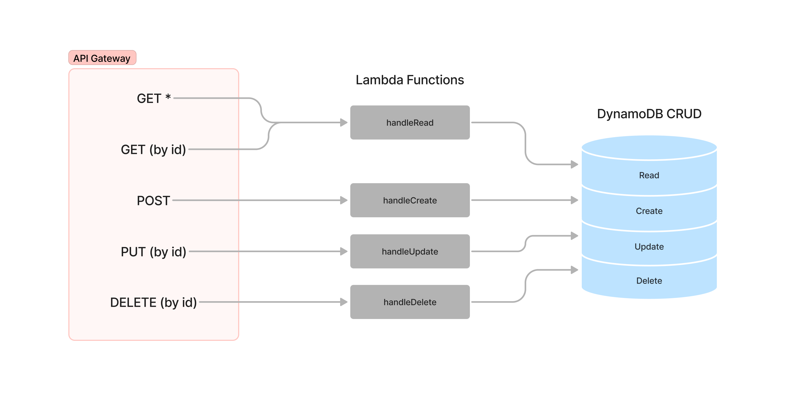

# LAB - Class 18

## Project: AWS: API, Dynamo and Lambda

### Author: Student/Group Name

### Problem Domain

Create a serverless REST API with CRUD Operations handled by Lambda Functions.

### Links and Resources

- Lecture Notes by Ryan Gallaway
- [Dynamoose Docs](https://dynamoosejs.com/guide/Model)

#### Documentation

##### What is the root URL to your API?

- [Root URL for the People Route](https://dncy939u57.execute-api.us-west-2.amazonaws.com/dev/people)

##### What are the routes?

- GET
  - `/people` - Get all people from DynamoDB
  - `/people/{id}` - Get specific id
- POST
  - `/people` - Create new record
- PUT
  - `/people/{id}` - Update specific record
- DELETE
  - `/people/{id}` - Delete a specific record

##### What inputs do they require?

- `GET /people/{id}` - Only input required is the `{id}` parameter to be entered in the API Gateway
- `PUT /people/{id}` - Requires is the `{id}` parameter to be entered in the API Gateway, as well as the content to be updated in the body in proper json format. Content can be either `name`, `age`, or `both`.

  ``` json
  {
    "name":"<NAME TO BE UPDATE>",
    "age": 9999
  }
  ```

- `DELETE /people/{id}` - Only input required is the `{id}` parameter to be entered in the API Gateway

##### What output do they return?

- GET
  - `/people` - Outputs ALL records in the DB
  - `/people/{id}` - returns a specific record from the DB
- POST
  - `/people` - Returns record created
- PUT
  - `/people/{id}` - Returns success message and content changes
- DELETE
  - `/people/{id}` - Returns success message

#### UML

- 
